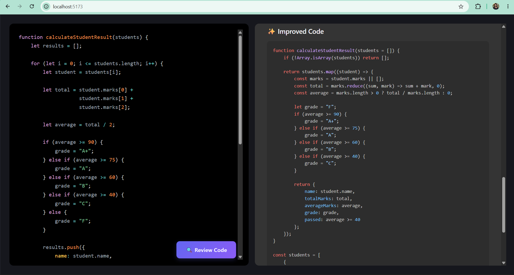
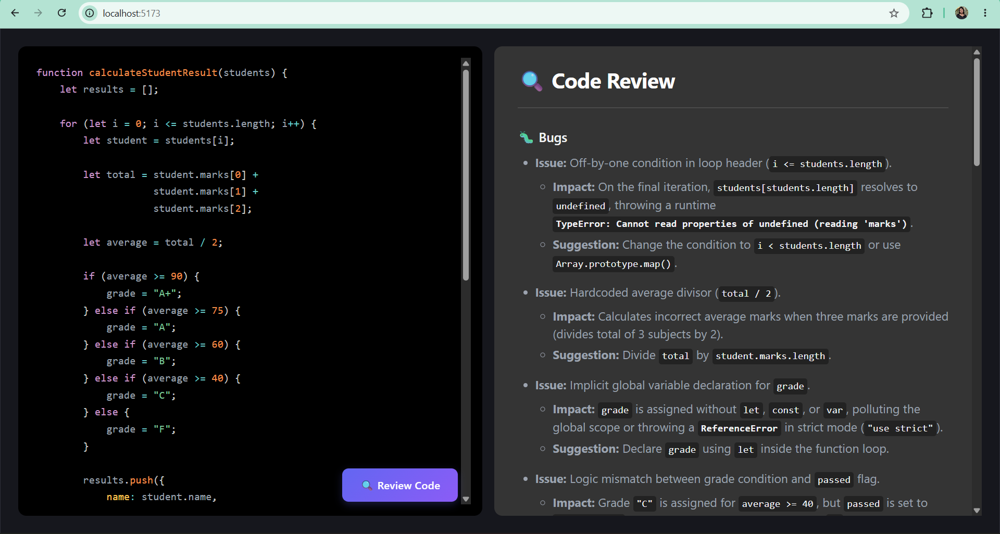
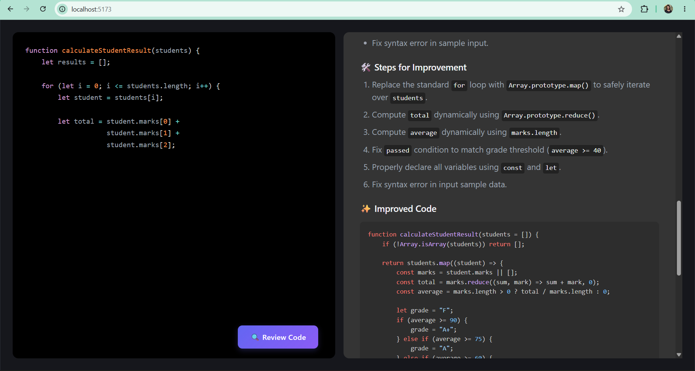

# 🤖 AI Code Reviewer

An AI-powered web application that reviews source code and provides intelligent feedback on **bugs, code quality, best practices, readability, and possible improvements**.

The project is built with a React frontend and a Node.js/Express backend, with Google's Gemini API used to generate the code review.

---

## ✨ Features

- 🧑‍💻 **Interactive Code Editor** — Write and edit code directly in the browser.
- 🎨 **Syntax Highlighting** — Code is highlighted using Prism.js.
- 🤖 **AI-Powered Code Review** — Submit code and receive an AI-generated review.
- 🐛 **Bug & Error Detection** — Helps identify potential issues in the submitted code.
- ⚡ **Code Quality Suggestions** — Get suggestions for cleaner and more maintainable code.
- 📚 **Best-Practice Recommendations** — Receive recommendations based on common programming practices.
- 💡 **Improvement Suggestions** — Understand how the code can be improved.
- 🔄 **Frontend–Backend Integration** — The React client communicates with the Express API.
- 🔐 **Environment Variables** — API credentials are kept outside the source code.

---

## 🖥️ Preview

The application provides a two-panel interface:

- **Left panel:** Code editor
- **Right panel:** AI-generated code review

Click **Review Code** to send the current code to the backend and generate an AI review.

### Code Review Interface



### Issues & Bug Detection



### Step-by-Step Improvements



---

## 🛠️ Tech Stack

### Frontend

- React.js
- Vite
- JavaScript
- CSS
- Prism.js
- React Simple Code Editor

### Backend

- Node.js
- Express.js
- JavaScript
- Google Gemini API
- `@google/genai`
- REST API

### Development Tools

- Git
- GitHub
- VS Code
- npm

---

## 📁 Project Structure

```text
Mern_Code_Reviewer/
│
├── Frontend/
│   └── Frontend/
│       ├── src/
│       │   ├── components/
│       │   ├── App.jsx
│       │   ├── main.jsx
│       │   └── ...
│       ├── public/
│       ├── package.json
│       └── vite.config.js
│
├── Backend/
│   ├── src/
│   │   ├── controllers/
│   │   │   └── ai.controller.js
│   │   ├── services/
│   │   │   └── ai.service.js
│   │   └── ...
│   ├── package.json
│   └── ...
│
└── README.md
